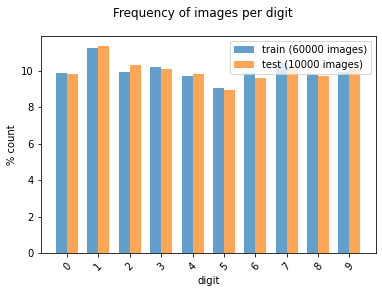

# Generating Sample MNIST Images using Generative Adversarial Networks (GANs)

  
## 1. Objectives

The objective of this project is to demonstrate the application of Generative Adversarial Networks (GANs) to generate sample MNIST images from noise.

## 2.  Generative Adversarial Networks (GANs)

Generative Adversarial Networks, or GANs for short, are an approach to generative modeling using deep learning methods, such as convolutional neural networks.

Generative modeling is an unsupervised learning task in machine learning that involves automatically discovering and learning the regularities or patterns in input data in such a way that the model can be used to generate or output new examples that plausibly could have been drawn from the original dataset.

GANs are a clever way of training a generative model by framing the problem as a supervised learning problem with two sub-models: the generator model that we train to generate new examples, and the discriminator model that tries to classify examples as either real (from the domain) or fake (generated). The two models are trained together in a zero-sum game, adversarial, until the discriminator model is fooled about half the time, meaning the generator model is generating plausible examples.

GANs are an exciting and rapidly changing field, delivering on the promise of generative models in their ability to generate realistic examples across a range of problem domains, most notably in image-to-image translation tasks such as translating photos of summer to winter or day to night, and in generating photorealistic photos of objects, scenes, and people that even humans cannot tell are fake.

In this project, we shall illustrate how to generate sample MNIST images, using Generative Adversarial Networks (GANs).

## 3. Data

We shall illustrate the PCA representation of the  MNIST database of handwritten digits, available from this page, which has a training set of 60,000 examples, and a test set of 10,000 examples. We shall illustrate sample images from this data sets in the next section

## 4. Development

* Project: Generating sample MNIST Hand-written images using Generative Adversarial Networks (GANs):

  * The objective of this project is to demonstrate how to generate sample MNIST hand-written images from noise, using Generative Adversarial Networks (GANS).
  * Author: Mohsen Ghazel (mghazel)
  * Date: April 9th, 2021

### 4.1. Part 1: Python imports and global variables:

#### 4.1.1. Standard scientific Python imports:

<pre style="color:#000020;background:#e6ffff;font-size:10px;line-height:1.5;"># numpy
import numpy as np
# matplotlib
import matplotlib.pyplot as plt
# - import sklearn to use the confusion matrix function
from sklearn.metrics import confusion_matrix
# import imread
from skimage.io import imread
# import itertools
import itertools
# opencv
import cv2
# tensorflow
import tensorflow as tf
# pandas imports
import pandas as pd

# keras input layer
from tensorflow.keras.layers import Input
# keras conv2D layer
from tensorflow.keras.layers import Conv2D
# keras MaxPooling2D layer
from tensorflow.keras.layers import MaxPooling2D
# keras Dense layer
from tensorflow.keras.layers import Dense
# keras Flatten layer
from tensorflow.keras.layers import Flatten
# keras Dropout layer
from tensorflow.keras.layers import Dropout
# keras model
from tensorflow.keras.models import Model
# keras sequential model
from tensorflow.keras.models import Sequential
# keras LeakyReLU layer
from tensorflow.keras.layers import LeakyReLU
# keras LeakyReLU layer
from tensorflow.keras.layers import BatchNormalization
# optimizers
# SGD
from tensorflow.keras.optimizers import SGD
# Adam
from tensorflow.keras.optimizers import Adam
# random number generators values
# seed for reproducing the random number generation
from random import seed
# random integers: I(0,M)
from random import randint
# random standard unform: U(0,1)
from random import random
# time
import datetime
# I/O
import os
# sys
import sys
</pre>

<pre style="color:#000020;background:#e6ffff;font-size:10px;line-height:1.5;"># check for successful package imports and versions
# python
print("Python version : {0} ".format(sys.version))
# OpenCV
print("OpenCV version : {0} ".format(cv2.__version__))
# numpy
print("Numpy version  : {0}".format(np.__version__))
# tensorflow
print("Tensorflow version  : {0}".format(tf.__version__))

Python version : 3.7.10 (default, May  3 2021, 02:48:31) 
[GCC 7.5.0] 
OpenCV version : 4.1.2 
Numpy version  : 1.19.5
Tensorflow version  : 2.4.1
</pre>

### 4.1.2. Global variables:

<pre style="color:#000020;background:#e6ffff;font-size:10px;line-height:1.5;"># -set the random_state seed = 100 for reproducibilty
random_state_seed = 100

# the number of visualized images
num_visualized_images = 25

#------------------------------------------
# GANs Hyper-parameters Parameters:
#------------------------------------------
# Dimensionality of the latent space
latent_dim = 100
#------------------------------------------
# Config parameters
# batch-sze
batch_size = 32
# the number of epochs
epochs = 30000
# after every sample_period steps generate 
# and save some data
sample_period = 500 
#------------------------------------------
</pre>

### 4.2 Part 2: Load MNIST Dataset:

#### 4.2.1. Load the MNIST dataset :

* Load the MNIST dataset of handwritten digits:
  * 60,000 labelled training examples
  * 10,000 labelled test examples
  * Each handwritten example is 28x28 pixels binary image.

<pre style="color:#000020;background:#e6ffff;font-size:10px;line-height:1.5;"># Load in the data
mnist = tf.keras.datasets.mnist
# load the training and test data
(x_train, y_train), (x_test, y_test) = mnist.load_data()
# map inputs to (-1, +1) for better training
x_train, x_test = x_train / 255.0 * 2 - 1, x_test / 255.0 * 2 - 1
print("x_train.shape:", x_train.shape)

Downloading data from https://storage.googleapis.com/tensorflow/tf-keras-datasets/mnist.npz
11493376/11490434 [==============================] - 0s 0us/step
x_train.shape: (60000, 28, 28)
</pre>

#### 4.2.2. Examine the shapes of the training and test data:

<pre style="color:#000020;background:#e6ffff;font-size:10px;line-height:1.5;">#------------------------------------------------------
# Training data:
#------------------------------------------------------
# the number of training images
num_train_images = x_train.shape[0]
print("----------------------------------------------")
print("Training data:")
print("----------------------------------------------")
print("x_train.shape: ", x_train.shape)
print("Number of training images: ", num_train_images)
print("Image size: ", x_train.shape[1:])
print("----------------------------------------------")
print("Classes/labels:")
print("----------------------------------------------")
print('The target labels: ' + str(np.unique(y_train)))
print("----------------------------------------------")

#------------------------------------------------------
# Test data:
#------------------------------------------------------
# the number of test images
num_test_images = x_test.shape[0]
print("----------------------------------------------")
print("Test data:")
print("----------------------------------------------")
print("x_test.shape: ", x_test.shape)
print("Number of test images: ", num_test_images)
print("Image size: ", x_test.shape[1:])
print("----------------------------------------------")
print("Classes/labels:")
print("----------------------------------------------")
print('The target labels: ' + str(np.unique(y_train)))
print("----------------------------------------------")

----------------------------------------------
Training data:
----------------------------------------------
x_train.shape:  (60000, 28, 28)
Number of training images:  60000
Image size:  (28, 28)
----------------------------------------------
Classes/labels:
----------------------------------------------
The target labels: [0 1 2 3 4 5 6 7 8 9]
----------------------------------------------
----------------------------------------------
Test data:
----------------------------------------------
x_test.shape:  (10000, 28, 28)
Number of test images:  10000
Image size:  (28, 28)
----------------------------------------------
Classes/labels:
----------------------------------------------
The target labels: [0 1 2 3 4 5 6 7 8 9]
----------------------------------------------
</pre>

#### 4.2.3. Examine the number of images for each class of the training and testing subsets:

<pre style="color:#000020;background:#e6ffff;font-size:10px;line-height:1.5;"># create a histogram of the number of images in each class/digit:
def plot_bar(y, loc='left', relative=True):
    width = 0.35
    if loc == 'left':
        n = -0.5
    elif loc == 'right':
        n = 0.5
     
    # calculate counts per type and sort, to ensure their order
    unique, counts = np.unique(y, return_counts=True)
    sorted_index = np.argsort(unique)
    unique = unique[sorted_index]
     
    if relative:
        # plot as a percentage
        counts = 100*counts[sorted_index]/len(y)
        ylabel_text = '% count'
    else:
        # plot counts
        counts = counts[sorted_index]
        ylabel_text = 'count'
         
    xtemp = np.arange(len(unique))
    plt.bar(xtemp + n*width, counts, align='center', alpha=.7, width=width)
    plt.xticks(xtemp, unique, rotation=45)
    plt.xlabel('digit')
    plt.ylabel(ylabel_text)
 
plt.suptitle('Frequency of images per digit')
plot_bar(y_train, loc='left')
plot_bar(y_test, loc='right')
plt.legend([
    'train ({0} images)'.format(len(y_train)), 
    'test ({0} images)'.format(len(y_test)), 
]);
</pre>

#### 4.2.4. Visualize some of the training and test images and their associated targets:

* First implement a visualization functionality to visualize the number of randomly selected images:

<pre style="color:#000020;background:#e6ffff;font-size:10px;line-height:1.5;">"""
# A utility function to visualize multiple images:
"""
def visualize_images_and_labels(num_visualized_images = 25, dataset_flag = 1):
  """To visualize images.

&nbsp;&nbsp;&nbsp;&nbsp;&nbsp;&nbsp;Keyword arguments:
&nbsp;&nbsp;&nbsp;&nbsp;&nbsp;&nbsp;&nbsp;&nbsp;&nbsp;- num_visualized_images -- the number of visualized images (deafult 25)
&nbsp;&nbsp;&nbsp;&nbsp;&nbsp;&nbsp;&nbsp;&nbsp;&nbsp;- dataset_flag -- 1: training dataset, 2: test dataset
&nbsp;&nbsp;&nbsp;&nbsp;&nbsp;&nbsp;Return:
&nbsp;&nbsp;&nbsp;&nbsp;&nbsp;&nbsp;&nbsp;&nbsp;&nbsp;- None
&nbsp;&nbsp;"""
  #--------------------------------------------
  # the suplot grid shape:
  #--------------------------------------------
  num_rows = 5
  # the number of columns
  num_cols = num_visualized_images // num_rows
  # setup the subplots axes
  fig, axes = plt.subplots(nrows=num_rows, ncols=num_cols, figsize=(8, 10))
  # set a seed random number generator for reproducible results
  seed(random_state_seed)
  # iterate over the sub-plots
  for row in range(num_rows):
      for col in range(num_cols):
        # get the next figure axis
        ax = axes[row, col];
        # turn-off subplot axis
        ax.set_axis_off()
        #--------------------------------------------
        # if the dataset_flag = 1: Training data set
        #--------------------------------------------
        if ( dataset_flag == 1 ): 
          # generate a random image counter
          counter = randint(0,num_train_images)
          # get the training image
          image = np.squeeze(x_train[counter,:])
          # get the target associated with the image
          label = y_train[counter]
        #--------------------------------------------
        # dataset_flag = 2: Test data set
        #--------------------------------------------
        else: 
          # generate a random image counter
          counter = randint(0,num_test_images)
          # get the test image
          image = np.squeeze(x_test[counter,:])
          # get the target associated with the image
          label = y_test[counter]
        #--------------------------------------------
        # display the image
        #--------------------------------------------
        ax.imshow(image, cmap=plt.cm.gray_r, interpolation='nearest')
        # set the title showing the image label
        ax.set_title('y =' + str(label), size = 8)
</pre>

##### 4.2.4.1. Visualize some of the training images and their associated targets:

<pre style="color:#000020;background:#e6ffff;font-size:10px;line-height:1.5;"># call the function to visualize the training images
visualize_images_and_labels(num_visualized_images, 1)
</pre>

##### 4.2.4.2. Visualize some of the test images and their associated targets:

<pre style="color:#000020;background:#e6ffff;font-size:10px;line-height:1.5;"># call the function to visualize the test images
visualize_images_and_labels(num_visualized_images, 2)
</pre>

#### 4.2.7. Reshape the training and test images:
* The training and test images are 2D grayscale images of size 28x28 pixels
* They need to be flattened to 1D vectors of size: 28x28

<pre style="color:#000020;background:#e6ffff;font-size:10px;line-height:1.5;"># Flatten the data
N, H, W = x_train.shape
# the vector length
D = H * W
# reshape the training features
x_train = x_train.reshape(-1, D)
# reshape the test features
x_test = x_test.reshape(-1, D)
</pre>

##### 4.2.7.1. Examine the reshaped training and test images:

<pre style="color:#000020;background:#e6ffff;font-size:10px;line-height:1.5;">#------------------------------------------------------
# Training data:
#------------------------------------------------------
print("----------------------------------------------")
print("Training data:")
print("----------------------------------------------")
print("x_train.shape: ", x_train.shape)
print("Number of training images: ", num_train_images)
print("Image size: ", x_train.shape[1:])
print("----------------------------------------------")

#------------------------------------------------------
# Test data:
#------------------------------------------------------
# the number of test images
num_test_images = x_test.shape[0]
print("----------------------------------------------")
print("Test data:")
print("----------------------------------------------")
print("x_test.shape: ", x_test.shape)
print("Number of test images: ", num_test_images)
print("Image size: ", x_test.shape[1:])
print("----------------------------------------------")

----------------------------------------------
Training data:
----------------------------------------------
x_train.shape:  (60000, 784)
Number of training images:  60000
Image size:  (784,)
----------------------------------------------
----------------------------------------------
Test data:
----------------------------------------------
x_test.shape:  (10000, 784)
Number of test images:  10000
Image size:  (784,)
----------------------------------------------
</pre>

### 4.3. Part 3: Construct the GANs Model

#### 4.3.1. The Generator Model:

* Define a function to to design and construct the Generator model:

<pre style="color:#000020;background:#e6ffff;font-size:10px;line-height:1.5;"># Design and construct the Generator model
def build_generator(latent_dim):
  # Input layer
  i = Input(shape=(latent_dim,))
  # Dense layer
  x = Dense(256, activation=LeakyReLU(alpha=0.2))(i)
  # BatchNormalization layer
  x = BatchNormalization(momentum=0.7)(x)
  # Dense layer
  x = Dense(512, activation=LeakyReLU(alpha=0.2))(x)
  # BatchNormalization layer
  x = BatchNormalization(momentum=0.7)(x)
  # Dense layer
  x = Dense(1024, activation=LeakyReLU(alpha=0.2))(x)
  # BatchNormalization layer
  x = BatchNormalization(momentum=0.7)(x)
  # Dense layer
  x = Dense(D, activation='tanh')(x)
  # constuct the Generator model
  model = Model(i, x)
  # return the constructed model
  return model
</pre>

#### 4.3.2. The Discriminator Model:

* Define a function to design and construct the Discriminator model:

<pre style="color:#000020;background:#e6ffff;font-size:10px;line-height:1.5;"># Design and construct the Discriminator model
def build_discriminator(img_size):
  # Input layer
  i = Input(shape=(img_size,))
  # Dense layer
  x = Dense(512, activation=LeakyReLU(alpha=0.2))(i)
  # Dense layer
  x = Dense(256, activation=LeakyReLU(alpha=0.2))(x)
  # Dense layer
  x = Dense(1, activation='sigmoid')(x)
  # constuct the Generator model
  model = Model(i, x)
  # return the constructed model
  return model
</pre>

### 4.4 Part 4: Construct and compile the GANs Models

#### 4.4.1. Construct and compile the Discriminator Model:

<pre style="color:#000020;background:#e6ffff;font-size:10px;line-height:1.5;">#-----------------------------------------
# Build and compile the discriminator
#-----------------------------------------
# Build the Discriminator model
discriminator = build_discriminator(D)

# Compile the Discriminator model
discriminator.compile(
    loss='binary_crossentropy',
    optimizer=Adam(0.0002, 0.5),
    metrics=['accuracy'])
</pre>

### 4.4.2. Construct and compile the Combined Model:

<pre style="color:#000020;background:#e6ffff;font-size:10px;line-height:1.5;">#-----------------------------------------
# Build and compile the combined model
#-----------------------------------------
# Build the Generator model
generator = build_generator(latent_dim)

# Create an input to represent noise sample from latent space
z = Input(shape=(latent_dim,))

# Pass noise through generator to get an image
img = generator(z)

# Make sure only the generator is trained
discriminator.trainable = False

# The true output is fake, but we label them real!
fake_pred = discriminator(img)

# Create the combined model object
combined_model = Model(z, fake_pred)

# Compile the combined model
combined_model.compile(loss='binary_crossentropy', optimizer=Adam(0.0002, 0.5))
</pre>

### 4.5. Part 5: Train the GANs Model:

#### 4.5.1 First implement a utility function to generate random samples from the generator:

<pre style="color:#000020;background:#e6ffff;font-size:10px;line-height:1.5;"># A function to generate a grid of 5x5 random samples from the generator
# and save them to a file
def sample_images(epoch):
  rows, cols = 5, 5
  noise = np.random.randn(rows * cols, latent_dim)
  imgs = generator.predict(noise)

  # Rescale images 0 - 1
  imgs = 0.5 * imgs + 0.5

  fig, axs = plt.subplots(rows, cols)
  idx = 0
  for i in range(rows):
    for j in range(cols):
      axs[i,j].imshow(imgs[idx].reshape(H, W), cmap='gray')
      axs[i,j].axis('off')
      idx += 1
  fig.savefig("gan_images/%d.png" % epoch)
  plt.close()
</pre>

### 4.5.2. Start training the GANs models:

<pre style="color:#000020;background:#e6ffff;font-size:10px;line-height:1.5;"># Create batch labels to use when calling train_on_batch
ones = np.ones(batch_size)
zeros = np.zeros(batch_size)

# Store the losses
d_losses = []
g_losses = []

# Create a folder to store generated images
if not os.path.exists('gan_images'):
  os.makedirs('gan_images')

# Main training loop
for epoch in range(epochs):
  #-------------------------------------------
  # Step 1: Train the discriminator model:
  #-------------------------------------------
  # Select a random batch of images
  idx = np.random.randint(0, x_train.shape[0], batch_size)
  real_imgs = x_train[idx]
  
  # Generate fake images
  noise = np.random.randn(batch_size, latent_dim)
  fake_imgs = generator.predict(noise)
  
  # Train the discriminator
  # both loss and accuracy are returned
  d_loss_real, d_acc_real = discriminator.train_on_batch(real_imgs, ones)
  d_loss_fake, d_acc_fake = discriminator.train_on_batch(fake_imgs, zeros)
  d_loss = 0.5 * (d_loss_real + d_loss_fake)
  d_acc  = 0.5 * (d_acc_real + d_acc_fake)
  
  #-------------------------------------------
  # Step 2: Train the combined model:
  #-------------------------------------------
  # generate random Gaussian normal
  noise = np.random.randn(batch_size, latent_dim)
  # train the combined model
  g_loss = combined_model.train_on_batch(noise, ones)
  
  # Do it again: generate random Gaussian normal
  noise = np.random.randn(batch_size, latent_dim)
  # train the combined model
  g_loss = combined_model.train_on_batch(noise, ones)
  
  # Save the losses
  d_losses.append(d_loss)
  g_losses.append(g_loss)
  # log the losses for certain epochs
  if epoch % 100 == 0:
    print(f"epoch: {epoch+1}/{epochs}, d_loss: {d_loss:.2f}, \
&nbsp;&nbsp;&nbsp;&nbsp;&nbsp;&nbsp;d_acc: {d_acc:.2f}, g_loss: {g_loss:.2f}")
  # save the images for certain epochs
  if epoch % sample_period == 0:
    sample_images(epoch)
</pre>

<pre style="color:#000020;background:#e6ffff;font-size:10px;line-height:1.5;">epoch: 1/30000, d_loss: 0.91,       d_acc: 0.14, g_loss: 0.64
epoch: 101/30000, d_loss: 0.16,       d_acc: 0.97, g_loss: 2.78
epoch: 201/30000, d_loss: 0.65,       d_acc: 0.67, g_loss: 1.26
epoch: 301/30000, d_loss: 0.73,       d_acc: 0.42, g_loss: 0.61
epoch: 401/30000, d_loss: 0.70,       d_acc: 0.47, g_loss: 0.61
epoch: 501/30000, d_loss: 0.69,       d_acc: 0.48, g_loss: 0.63
...............................................................
...............................................................
...............................................................
epoch: 29501/30000, d_loss: 0.65,       d_acc: 0.64, g_loss: 0.83
epoch: 29601/30000, d_loss: 0.74,       d_acc: 0.48, g_loss: 0.91
epoch: 29701/30000, d_loss: 0.63,       d_acc: 0.67, g_loss: 0.94
epoch: 29801/30000, d_loss: 0.68,       d_acc: 0.59, g_loss: 0.86
epoch: 29901/30000, d_loss: 0.64,       d_acc: 0.62, g_loss: 0.87
</pre>

### 4.6. Part 6: Evaluate the trained Discriminator and Generator models:

#### 4.6.1. Display the Training losses:

<pre style="color:#000020;background:#e6ffff;font-size:10px;line-height:1.5;"># create a figure and set its axis
fig_size = (10,8)
# create the figure 
plt.figure(figsize=fig_size)
# plot the generator model losses
plt.plot(g_losses, label='Generator-losses')
# plot the discriminator model losses
plt.plot(d_losses, label='Discriminator-losses')
# add legend
plt.legend()
# add xlabel
plt.xlabel('Epoch')
# add ylabel
plt.ylabel('Loss')
# add title
plt.title('Discriminator and Generator Losses vs. Epochs')
# display the figure
plt.show()
</pre>

### 4.7. Part 7: Visualize some of the generated results:

#### 4.7.1. List the saved generated images at different epochs:

<pre style="color:#000020;background:#e6ffff;font-size:10px;line-height:1.5;"># list the content of the saved images folder
!ls gan_images

0.png	   13500.png  17500.png  21500.png  25500.png  3000.png  7000.png
10000.png  14000.png  18000.png  22000.png  26000.png  3500.png  7500.png
1000.png   14500.png  18500.png  22500.png  26500.png  4000.png  8000.png
10500.png  15000.png  19000.png  23000.png  27000.png  4500.png  8500.png
11000.png  1500.png   19500.png  23500.png  27500.png  5000.png  9000.png
11500.png  15500.png  20000.png  24000.png  28000.png  500.png	 9500.png
12000.png  16000.png  2000.png	 24500.png  28500.png  5500.png
12500.png  16500.png  20500.png  25000.png  29000.png  6000.png
13000.png  17000.png  21000.png  2500.png   29500.png  6500.png
</pre>

#### 4.7.2.Visualize sample generated images after different epochs:

<pre style="color:#000020;background:#e6ffff;font-size:10px;line-height:1.5;">#------------------------------------------------
# Display sample generated images at epoch: 0
#------------------------------------------------
# these should be pure Gaussian noise
im = imread('gan_images/0.png')
# create a figure and set its axis
fig_size = (16,16)
# create the figure 
plt.figure(figsize=fig_size)
# display the image
plt.imshow(im)
# hide the axes
plt.axis('off')
# display the figure
plt.show()
</pre>

<figure>

<blockquote align="center"> After 0 Iterations </blockquote>
</figure>

<pre style="color:#000020;background:#e6ffff;font-size:10px;line-height:1.5;">#------------------------------------------------
# Display sample generated images at epoch: 1000
#------------------------------------------------
# these should resemble hand-written digits
im = imread('gan_images/1000.png')
# create a figure and set its axis
fig_size = (16,16)
# create the figure 
plt.figure(figsize=fig_size)
# display the image
plt.imshow(im)
# hide the axes
plt.axis('off')
# display the figure
plt.show()
</pre>

<figure>

<blockquote align="center"> After 1000 Iterations </blockquote>
</figure>

<pre style="color:#000020;background:#e6ffff;font-size:10px;line-height:1.5;">#------------------------------------------------
# Display sample generated images at epoch: 5000
#------------------------------------------------
# these should resemble hand-written digits
im = imread('gan_images/5000.png')
# create a figure and set its axis
fig_size = (16,16)
# create the figure 
plt.figure(figsize=fig_size)
# display the image
plt.imshow(im)
# hide the axes
plt.axis('off')
# display the figure
plt.show()
</pre>

<figure>

<blockquote align="center"> After 5000 Iterations </blockquote>
</figure>

<pre style="color:#000020;background:#e6ffff;font-size:10px;line-height:1.5;">#------------------------------------------------
# Display sample generated images at epoch: 10000
#------------------------------------------------
# these should resemble hand-written digits
im = imread('gan_images/10000.png')
# create a figure and set its axis
fig_size = (16,16)
# create the figure 
plt.figure(figsize=fig_size)
# display the image
plt.imshow(im)
# hide the axes
plt.axis('off')
# display the figure
plt.show()
</pre>

<figure>

<blockquote align="center"> After 10000 Iterations </blockquote>
</figure>

<pre style="color:#000020;background:#e6ffff;font-size:10px;line-height:1.5;">#------------------------------------------------
# Display sample generated images at epoch: 20000
#------------------------------------------------
# these should resemble hand-written digits
im = imread('gan_images/20000.png')
# create a figure and set its axis
fig_size = (16,16)
# create the figure 
plt.figure(figsize=fig_size)
# display the image
plt.imshow(im)
# hide the axes
plt.axis('off')
# display the figure
plt.show()
</pre>

<figure>

<blockquote align="center"> After 20000 Iterations </blockquote>
</figure>

<pre style="color:#000020;background:#e6ffff;font-size:10px;line-height:1.5;">#------------------------------------------------
# Display sample generated images the end of 
# training at epoch: 30,0000
#------------------------------------------------
# these should resemble hand-written digits
im = imread('gan_images/29500.png')
# create a figure and set its axis
fig_size = (16,16)
# create the figure 
plt.figure(figsize=fig_size)
# display the image
plt.imshow(im)
# hide the axes
plt.axis('off')
# display the figure
plt.show()
</pre>

<figure>

<blockquote align="center"> After 30000 Iterations </blockquote>
</figure>

### 3.8. Part 8: Display a successful execution message:

<pre style="color:#000020;background:#e6ffff;font-size:10px;line-height:1.5;"># display a final message
# current time
now = datetime.datetime.now()
# display a message
print('Program executed successfully on: '+ str(now.strftime("%Y-%m-%d %H:%M:%S") + "...Goodbye!\n"))

Program executed successfully on: 2021-05-10 03:29:48...Goodbye!
</pre>

## 5. Analysis

* In view of the presented results, we make the following observations:

  * The generated MNIST fake images look very similar to actual MNIST images
  * These images are generated starting from random Gaussian noise from the latent space
  * This quick example demonstrates how GANs perform

## 6. Future Work

* We plan to explore the following related issues:

  * In this example, we implemented GANs as feedforward model
  * We plan to implemented GANs using convolutional layers

## 7. References

1. Yann LeCun et. al. THE MNIST DATABASE of handwritten digits. http://yann.lecun.com/exdb/mnist/ 
2. Jason Brownlee. A Gentle Introduction to Generative Adversarial Networks (GANs). https://machinelearningmastery.com/what-are-generative-adversarial-networks-gans/ 
3. Daniele Paliotta. Introduction to GANs with Python and TensorFlow. https://stackabuse.com/introduction-to-gans-with-python-and-tensorflow/ 
4. Renato Candido. Generative Adversarial Networks: Build Your First Models. https://realpython.com/generative-adversarial-networks/ 
5. Jason Brownlee. Generative Adversarial Networks with Python: Deep Learning Generative Models for Image Synthesis and Image Translation. https://machinelearningmastery.com/generative_adversarial_networks/ 
6. Jason Brownlee. How to Develop a GAN for Generating MNIST Handwritten Digits. https://machinelearningmastery.com/how-to-develop-a-generative-adversarial-network-for-an-mnist-handwritten-digits-from-scratch-in-keras/ 
7. Paolo Caressa. How to build a GAN in Python. https://www.codemotion.com/magazine/dev-hub/machine-learning-dev/how-to-build-a-gan-in-python/ 
8. Sadrach Pierre. Generative Adversarial Networks in Python Introduction to GANs in Python. https://towardsdatascience.com/generative-adversarial-networks-in-python-73d3972823d3 
9. Tensorflow. Deep Convolutional Generative Adversarial Network. https://www.tensorflow.org/tutorials/generative/dcgan 
10. Adrian Rosebrock. GANs with Keras and TensorFlow. https://www.pyimagesearch.com/2020/11/16/gans-with-keras-and-tensorflow/ 
11. Diego Gomez Mosquera. GANs from Scratch 1: A deep introduction. With code in PyTorch and TensorFlow. https://medium.com/ai-society/gans-from-scratch-1-a-deep-introduction-with-code-in-pytorch-and-tensorflow-cb03cdcdba0f
 

